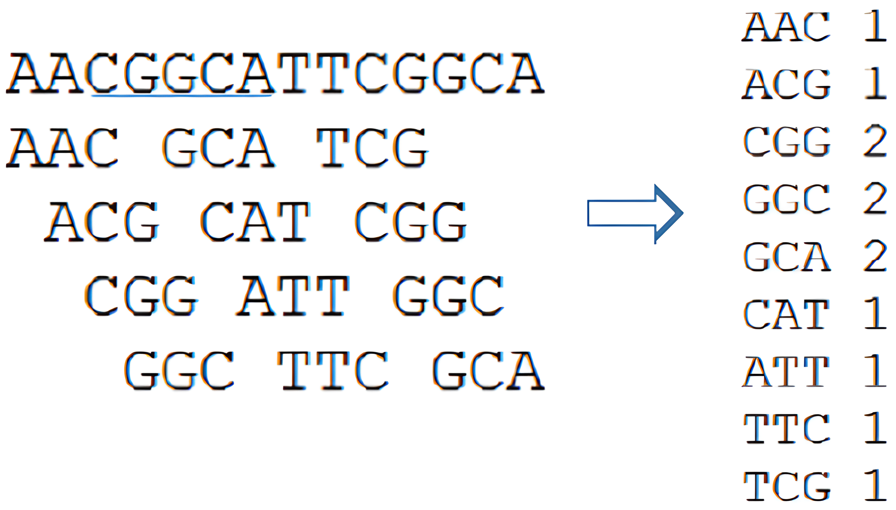

# KmerCounter

This Java project offers a solution to analyze the frequency of k-mers in both fasta and multifasta files. K-mers are subsequences of length k from a DNA sequence. Understanding their frequencies can provide valuable insights into genomic studies.

<div align="center">
    
</div>


## Project Components

### File 1: ADN.java
This file hosts the core functionalities within the `ADN` class. Here's an overview of its key methods and functions:

- **Constructor**
  - Initializes essential variables such as the input file, output file, k values, and reads the input file.

- **`toString()`**
  - Generates a formatted string representing the k-mer frequency analysis, either for a single k or a range of k values.

- **`leeFichero()`**
  - Reads the input fasta file and stores the sequences in a local text file for efficient processing.

- **`kmers(int k)`**
  - Calculates the k-mer frequencies for a given k and returns the results in a formatted string.

- **`calculaGlobal(int k)`**
  - Computes global k-mer frequencies when multiple sequences are provided.

- **`kmers(int k, String sec)`**
  - Calculates the k-mer frequencies for a specific sequence and returns the results in a formatted string.

- **Helper functions**
  - `calculaMaximo(Integer[] numeros)`: Calculates the maximum value in an array.
  - `StringToIndex(String kmer)`: Converts a k-mer string to its numerical index representation.
  - `IndexToString(int pos, int k)`: Converts a numerical index to its corresponding k-mer string.

### File 2: Ejecutable.java
This file includes the `Ejecutable` class, which contains the main method for executing the program. The key functionalities include reading input parameters, invoking the `ADN` class, and saving the results to an output file.

## Detailed Workflow

1. **Input Parameters**
   - The program receives the following input parameters:
     - Filename: The name of the fasta or multifasta file.
     - k1: The starting value for k.
     - k2 (optional): The ending value for k if a range is specified.

2. **File Reading and Preprocessing**
   - The program reads the input fasta/multifasta file and preprocesses the sequences, storing them in a local text file for efficient access and analysis.

3. **K-mer Frequency Calculation**
   - For each specified k value (single or range), the program calculates the k-mer frequencies and formats the results.

4. **Output Generation**
   - The program generates a formatted output string representing the k-mer frequency analysis.

5. **Result Presentation**
   - The results are displayed in the console and saved to an output text file.

## Example Usage
To analyze a fasta file named `TYLCV.fna` with k = 3, execute the following command:

```bash
java -jar kmercounter.jar TYLCV.fna 3
```

The program will calculate the k-mer frequencies for k = 3 and display the results in the console, saving them to an output file.

```txt
Solución para TYLCV.fna para k = 3: 

Frecuencia K-Mers para k = 3: 

 - Secuencia 1: 

AAA: 78 (0.02806765%)
AAC: 28 (0.010075566%)
AAG: 47 (0.016912559%)
AAT: 89 (0.032025907%)
ACA: 37 (0.013314142%)
ACC: 22 (0.007916517%)
ACG: 25 (0.0089960415%)
ACT: 30 (0.010795251%)
AGA: 39 (0.014033825%)
AGC: 28 (0.010075566%)
AGG: 43 (0.015473192%)
AGT: 35 (0.012594459%)
ATA: 61 (0.021950342%)
ATC: 46 (0.016552716%)
ATG: 70 (0.025188917%)
ATT: 84 (0.0302267%)
CAA: 42 (0.01511335%)
CAC: 26 (0.009355883%)
CAG: 34 (0.012234617%)
CAT: 51 (0.018351926%)
CCA: 43 (0.015473192%)
CCC: 42 (0.01511335%)
CCG: 18 (0.00647715%)
CCT: 37 (0.013314142%)
CGA: 24 (0.0086362%)
CGC: 16 (0.005757467%)
CGG: 13 (0.0046779416%)
CGT: 31 (0.011155092%)
CTA: 31 (0.011155092%)
CTC: 29 (0.010435408%)
CTG: 45 (0.016192876%)
CTT: 53 (0.019071609%)
GAA: 68 (0.024469234%)
GAC: 22 (0.007916517%)
GAG: 38 (0.0136739835%)
GAT: 49 (0.017632242%)
GCA: 31 (0.011155092%)
GCC: 39 (0.014033825%)
GCG: 14 (0.005037783%)
GCT: 25 (0.0089960415%)
GGA: 47 (0.016912559%)
GGC: 33 (0.011874775%)
GGG: 26 (0.009355883%)
GGT: 37 (0.013314142%)
GTA: 35 (0.012594459%)
GTC: 39 (0.014033825%)
GTG: 42 (0.01511335%)
GTT: 59 (0.021230659%)
TAA: 54 (0.01943145%)
TAC: 38 (0.0136739835%)
TAG: 26 (0.009355883%)
TAT: 72 (0.0259086%)
TCA: 42 (0.01511335%)
TCC: 37 (0.013314142%)
TCG: 27 (0.009715725%)
TCT: 66 (0.02374955%)
TGA: 67 (0.024109391%)
TGC: 32 (0.011514934%)
TGG: 61 (0.021950342%)
TGT: 72 (0.0259086%)
TTA: 63 (0.022670025%)
TTC: 58 (0.020870816%)
TTG: 75 (0.026988124%)
TTT: 88 (0.031666066%)
```

For further assistance or inquiries, please feel free to reach out. Explore the k-mer frequencies and gain valuable insights into your genomic data!
